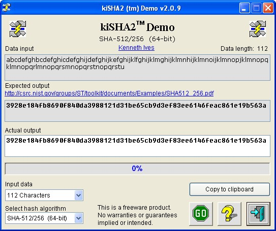



## SHA2 Hash Demo  15\-Jun\-2012

### Description

Hash demo of SHA2 family (SHA-1, SHA-224, SHA-256, SHA-384, SHA-512, SHA-512/224, SHA-512/256, SHA-512/320).

=== 25-May-2012 Added SHA-512/320 algorithm to clsSHA2.cls. Algorithm was created as per instructions in FIPS 180-4. See LoadConstants_64() routine in class.

=== 15-Jun-2012 Updated support modules and some minor tweaking for speed.
 
### More Info
 

             |
---                |---
**Submitted On**   |2012-06-14 18:38:54
**By**             |[Kenaso](https://github.com/Planet-Source-Code/PSCIndex/blob/master/ByAuthor/kenaso.md)
**Level**          |Intermediate
**User Rating**    |5.0 (20 globes from 4 users)
**Compatibility**  |VB 6\.0
**Category**       |[Encryption](https://github.com/Planet-Source-Code/PSCIndex/blob/master/ByCategory/encryption__1-48.md)
**World**          |[Visual Basic](https://github.com/Planet-Source-Code/PSCIndex/blob/master/ByWorld/visual-basic.md)
**Archive File**   |[SHA2\_Hash\_2224886142012\.zip](https://github.com/Planet-Source-Code/kenaso-sha2-hash-demo-15-jun-2012__1-73500/archive/master.zip)

